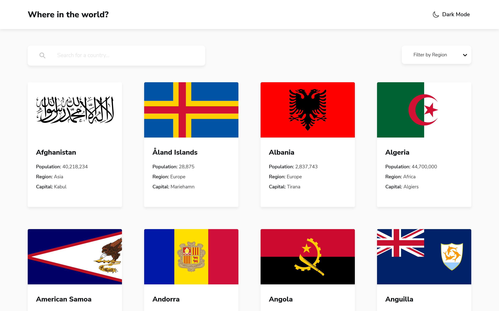

# Frontend Mentor - REST Countries API with color theme switcher solution

This is a solution to the [REST Countries API with color theme switcher challenge on Frontend Mentor](https://www.frontendmentor.io/challenges/rest-countries-api-with-color-theme-switcher-5cacc469fec04111f7b848ca). Frontend Mentor challenges help you improve your coding skills by building realistic projects.

## Table of contents

- [Frontend Mentor - REST Countries API with color theme switcher solution](#frontend-mentor---rest-countries-api-with-color-theme-switcher-solution)
  - [Table of contents](#table-of-contents)
  - [Overview](#overview)
    - [The challenge](#the-challenge)
    - [Screenshot](#screenshot)
    - [Links](#links)
  - [My process](#my-process)
    - [Built with](#built-with)
    - [What I learned](#what-i-learned)
    - [Continued development](#continued-development)
    - [Useful resources](#useful-resources)
  - [Author](#author)

## Overview

### The challenge

Users should be able to:

- See all countries from the API on the homepage
- Search for a country using an `input` field
- Filter countries by region
- Click on a country to see more detailed information on a separate page
- Click through to the border countries on the detail page
- Toggle the color scheme between light and dark mode *(optional)*

### Screenshot

### Links

- Solution URL: [Add solution URL here](https://www.frontendmentor.io/solutions/rest-countries-api-with-dark-mode-reactvitestyledcomponentsts-3wpkEGYF8i)
- Live Site URL: [Add live site URL here](https://rest-countries-api-vite-viniciuscosta89.vercel.app/)

## My process

### Built with

- Semantic HTML5 markup
- CSS custom properties
- Flexbox
- CSS Grid
- Mobile-first workflow
- [React](https://reactjs.org/) - JS library
- [Vite](https://vitejs.dev) - Frontend Tooling
- [Styled Components](https://styled-components.com/) - For styles
- [Typescript](typescriptlang.org/)
- [React Select](https://react-select.com/) - Select library
- [React Helmet](https://github.com/nfl/react-helmet) - Head manager for React
- [PNpm](https://pnpm.io) - Package manager
- [Conventional Commits](conventionalcommits.org/) - A specification for commit messages

### What I learned

- A better folders architecture with React Hooks, Context and Types.
- Theming with Styled Components.
- Cache with localStorage.
- PNPM as my package manager.
- Conventional Commits.

### Continued development

I want to use Frame Motion for some page transitions and implement tests with Cypress.

### Useful resources

- [About Convetional Commits](https://medium.com/linkapi-solutions/conventional-commits-pattern-3778d1a1e657) - This helped me for a better understanding about Conventional Commits.
- [Folder architecture](https://profy.dev/article/react-folder-structure) - This article helped me with some ideas for my project folder architecture.
  
## Author

- Frontend Mentor - [@viniciuscosta89](https://www.frontendmentor.io/profile/viniciuscosta89)
- LinkedIn - [@viniciuscosta89](linkedin.com/in/viniciuscosta89)